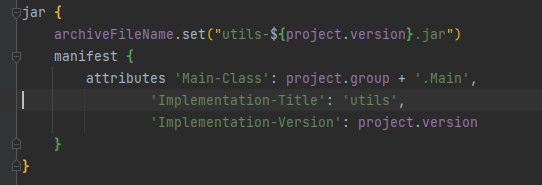
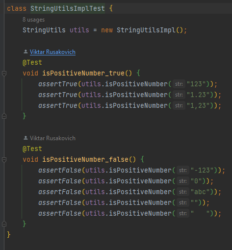
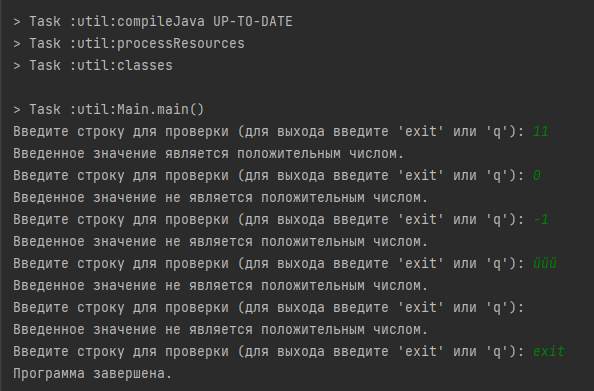
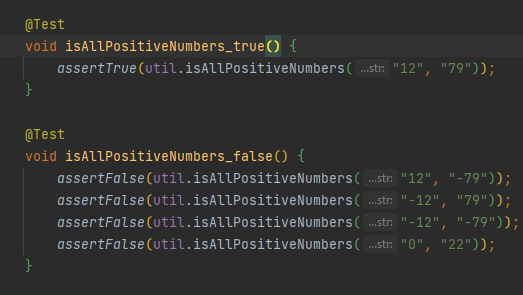

# clevertec_02_gradle

Task 
1. Установить Gradle 
2. Проект должен быть совместим с java 17 
3. Создать файл.jar, например, «utils-1.3.5.jar» 
4. Манифест файл должен содержать имя и версию вашего .jar файла 
 
5. В вашем .jar файле должен быть class StringUtils с методом boolean isPositiveNumber(String str) 
6. Написать один unit test для проверки этого метода (использовать JUnit 5).

7. Заполнить и отправить форму 

Дополнительно: 
1. Сделать gradle плагин, который также опубликовать и подключить к проекту, например плагин по формированию отчёта 
2. Создать мульти-модульный проект с двумя модулями: core, api 
3. В модуле core должен быть class Utils с методом boolean isAllPositiveNumbers(String… str)
4. Использовать utils-1.3.5.jar сделанный на предыдущих этапах, для возможности переиспользовать метод boolean isPositiveNumber(String str) в модуле core 
5. В модуле api должен быть class App с методом main. 
6. Из модуля api в методе main вызвать Utils.isAllPositiveNumbers("12", "79") 
7. Написать один unit test для проверки этого метода boolean isAllPositiveNumbers(String… str)(использовать JUnit 5).

